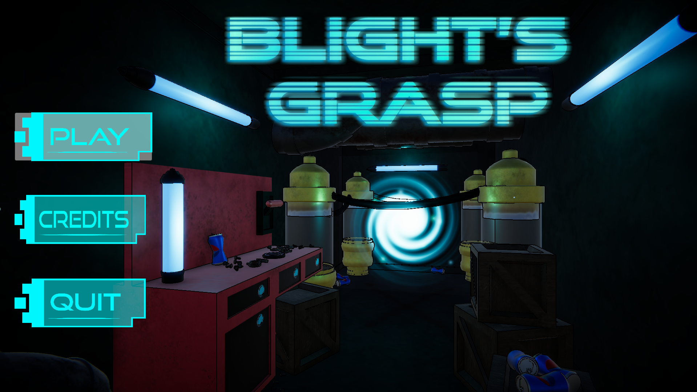
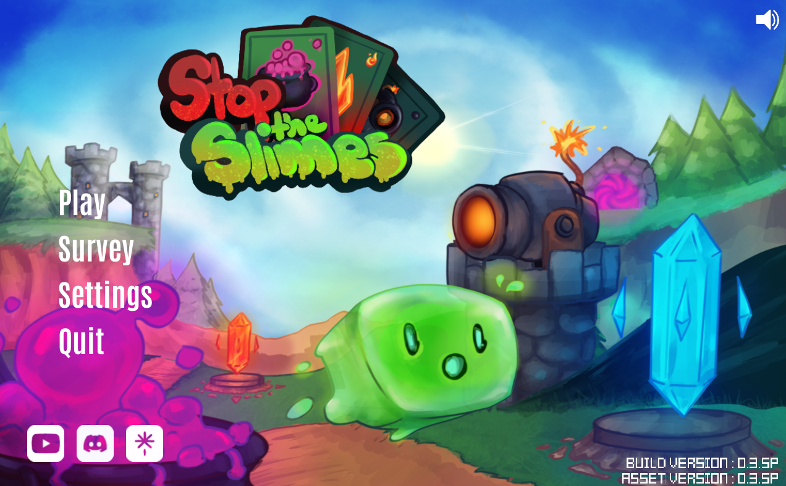
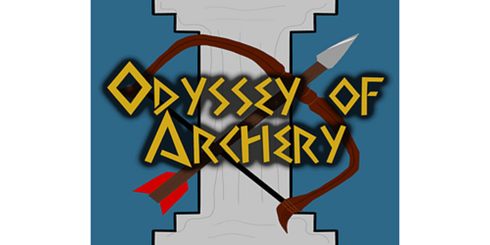
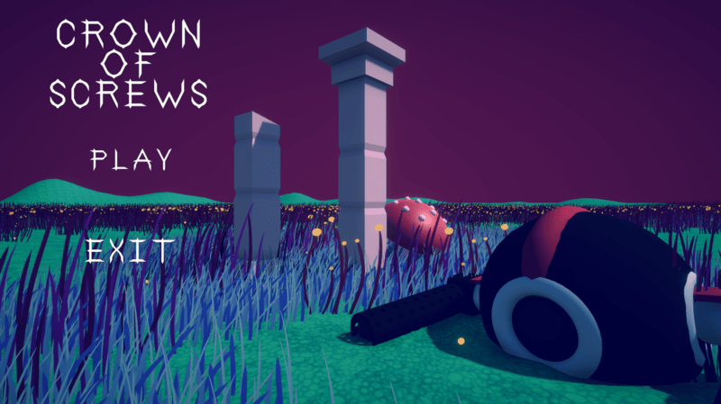
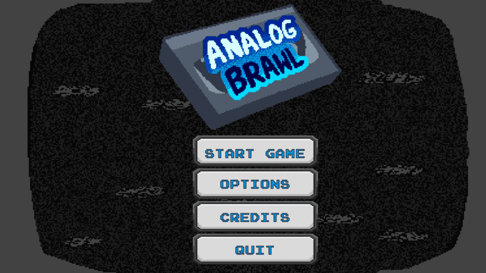
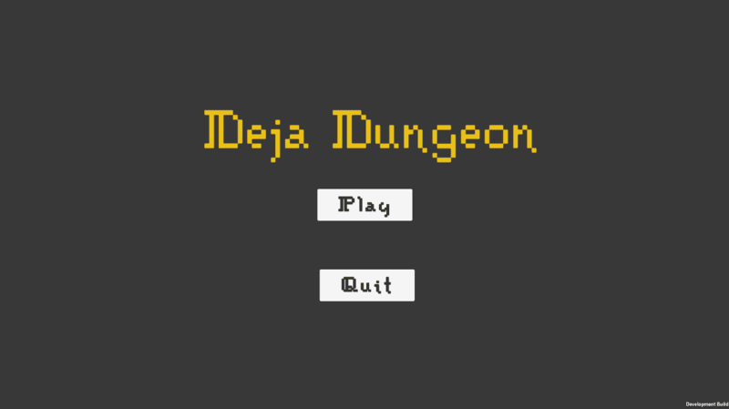
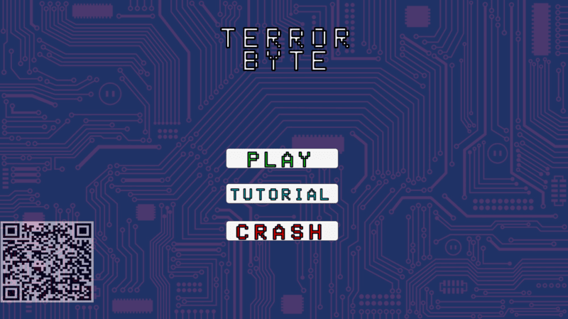
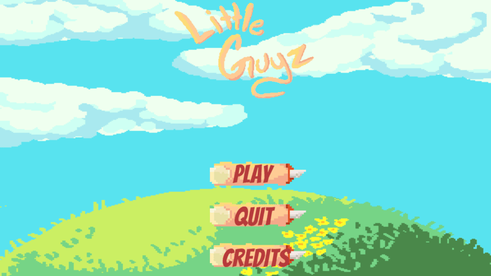
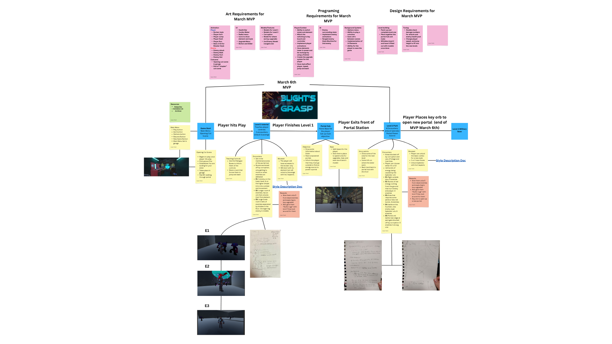

# Liam York Portfolio 

## Blight's Grasp

2024-2025 SAU GameDev Senior Project. On this team of 12 I was the Design Lead for this project helping form the pitch, creating a design doc, scoping our project and helping road map our plan. I also programmed the player movement, camera system, and controller support as well as helping with the combat system and creating our enemy encounters and levels. I worked on our steam page and achieved our release deadline of 4/29/25. 

Steam Page: <https://store.steampowered.com/app/3470150/Blights_Grasp/>

## Stop the Slimes

June 2025 Pre early access launch. I worked as a designer on this project and worked on the game balance and flow. Tested and tweaked all the towers, enemies and levels to see how they felt, adjusting all kinds of values from enemy speed to how much damage a tower deals. 

Steam Page: <https://store.steampowered.com/app/2659530/Stop_The_Slimes/>

## Odessey of Archery

2024 SAU VR Workshop Project. I was the Lead Designer on this project with a team size of 14. Building out levels, figuring out and designing VR controller layouts, creating puzzles and arrow concepts, and helping create a list of important assets for our art team. 

Itch Page Link: <https://saugamedev.itch.io/oddessey-of-archery>

## Crown of Screws

A Submission to the 8th annual LATech University Game Jam where it won the awards Best Overall and Developers Choice. I helped come up with our core concept to fit into the theme of our jam and our scope. I programmed the player movement, the player and enemy shooting, and implemented the background music. I also set up the barriers so the player can’t leave the map, helped come up with our power up concepts and made the tutorial.  

Itch Page Link: <https://yourgeekeric.itch.io/crown-of-screws>

## Analog Brawl

2023 SAU Game Studio Workshop game. This project had a team size of 13. I created and pitched the initial idea for the project. Worked as its Design Lead writing a design doc, creating a list of the required animation for the character, wrote out the movesets and helped balance the game. I programmed the unique charge mechanic, the walls that stop the player from leaving the arena and decided damage numbers, knockback and how fast attacks were.

Itch Page Link: <https://saugamedev.itch.io/analog-brawl>

## Deja-Dungeon

A submission to Jam Anonymous 3. I worked on designing and building the puzzles/levels. I programmed the player movement and the core mechanic of resetting the room you are in to solve puzzles. 

Itch Page Link: <https://xander-adams.itch.io/deja-dungeon>

## TerrorByte

A submission to the SAU 2023 Fall Game Jam which was then worked on further in Fundamentals of Game Programming II. I helped pitch the initial concept for this game. Programmed the player movement and attacking, helped create level layouts, programmed a randomized loot table that dropped items at varying rarities, and helped decide on enemy encounters and statics such as damage numbers and speed.   

Itch Page Link : <https://xander-adams.itch.io/terrorbyte>

## Little Guyz

A submission to the SAU 2024 Fall Game Jam. I programmed the turn based battle system, the level up system, the stats for the player and enemies, helped program the unique absorption mechanic and implimited the animations for the enemies.  

Itch Page Link: <https://coopercantrell.itch.io/little-guyz>

## Design Documentation I have Created 

## Blight's Grasp

A diagram depicting our March MVP 

Our Game Design Document for Blight's Grasp

Doc Link:<https://docs.google.com/document/d/1gFvubmwQqYzyojUwl8Spxi1kWuPpLPJ0tRQl8Slt-Vw/edit?tab=t.0#heading=h.wrle630s7fl>

