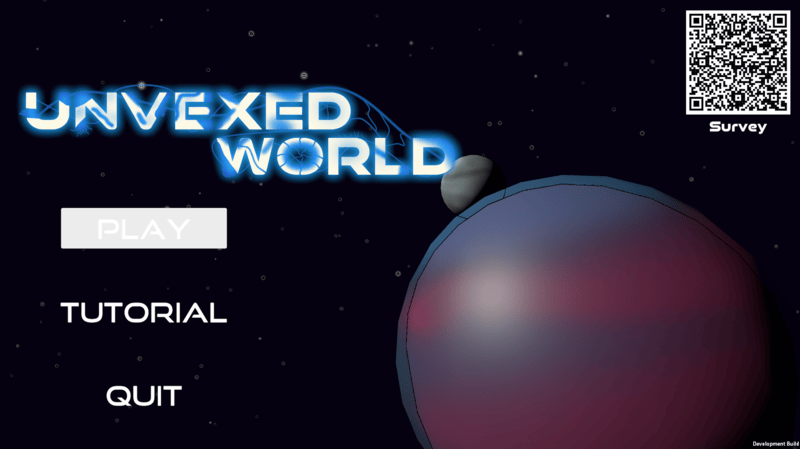

# Liam York Portfolio 

## Blights Grasp

2024-2025 SAU GameDev Senior Project. I worked as the Design Lead on this project helping form the pitch, creating a design doc, scoping our project and helping road map our plan. I also programmed the player movement, camera system, and controller support as well as helping with the combat system and creating our enemy encounters and levels.  

## Oddessey of Archery

2024 SAU VR Workshop Project. I was the Lead Designer on this project. Building out levels, figuring out and designing VR controller layouts, creating puzzles and arrow concepts, and helping create a list of important assets for our art team. 

Itch Page Link: <https://saugamedev.itch.io/oddessey-of-archery>

## Crown of Screws

A Submission to the 8th annual LATech University Game Jam where it won the awards Best Overall and Developers Choice. I helped come up with our core concept to fit into the theme of our jam and our scope. I programmed the player movement, the player and enemy shooting, and implemented the background music. I also set up the barriers so the player can’t leave the map, helped come up with our power up concepts and made the tutorial.  

Itch Page Link: <https://yourgeekeric.itch.io/crown-of-screws>

Itch Page Link : <https://xander-adams.itch.io/terrorbyte>
